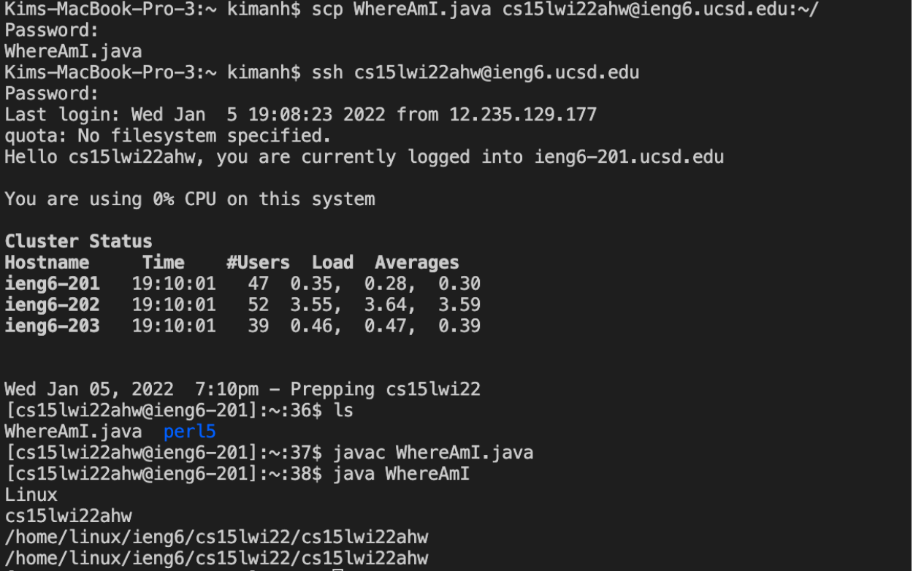

***
# Week 2 Lab Report 
***
*(This instruction steps are for Macbook. Some steps might be different if you are on Windows)* 
## Installing Visual Studio Code
* Go to the [Vscode website](https://code.visualstudio.com/) and click the download button and follow the instruction steps to install Vscode. 
* After installing, open VScode and you will see this window: 


## Remotely Connecting 
* **Find account:** Look up course-specific account for CSE 15L [here](https://sdacs.ucsd.edu/~icc/index.php). Type your UCSD username and student ID (start with an A) to find your personal account. You will need to reset your password before using your account to connect to the server. 
* **Connect to a remote host:** Using Visual Studio Code to the remote computer using VSCode’s remote option. In VScode:
    1. Open a terminal in VSCode by using Command + `, or using the Terminal → New Terminal menu option.
    2. Use this command to connect to the server: (replace the *ahw* with the letters in your course-specific account)
        ```
        $ ssh cs15lwi22ahw@ieng6.ucsd.edu
        ```
    3. If this is your first time connect to the sever, type `yes` to the message and press enter. Then, enter your password. Your terminal window should look like this after it is connected:
    

## Run Some Commands
* After connecting to remote server in your terminal, you can try running different commands. 
* **This is some useful command to try:**
    ```
    cd: change directory 
    ls: listing directory 
    pwd: print working directory
    cp: copy files and directories
    cat: display the content of text files and to   combine several files into one file
    exit: log out of the remote server in your terminal
    ```
    *Sample terminal window for some useful commands:*
    
    
    

## Moving Files with `scp`
* **scp:**  copy file(s) from your computer to remote computer. The command is always run from *client* (from your computer, not logged into `ieng6`)
* To try command `scp`:
    1. Create a file on your computer called `WhereAmI.java`.
    2. Run the file using `javac` and `java` on your computer.
    3. In terminal from the directory where you made this file, use the command: (replace the *ahw* with the letters in your course-specific account)
        ```
        scp WhereAmI.java cs15lwi22ahw@ieng6.ucsd.edu:~/
        ```
        
    4. Then use `ssh` to log into *ieng6* again, you can see the file in your home directory. 
        
        


