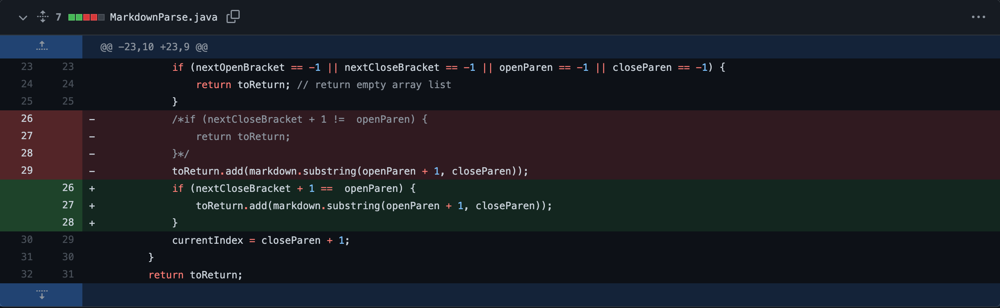

***
# Week 4 Lab Report 
*(Three code changes that our group worked on in labs 3 and 4 in order to fix a bug)*
## First Code Change:
1. Screenshot of the code change diff from Github:

2. Link to the test file for a *failure-inducing input*: [Test-file8](https://github.com/anhbch/CSE15L-TheLunaMoths/blob/main/test-file8.md)
3.  Output screenshot of the symptom of the *failure-inducing input*: 

4. Describing the relationship between the bug, the symptom, and the failure-inducing input: 
    * The test file has an invalid. However, the original code doesn't check if the link is valid, it only check for correct syntax *(which has **[] ()** with no space between)* and prints out the content inside **()**. Therefore, everything inside is considered valid. Thus, we received an error message that the expected value is empty but the program prints out an invalid link.

## Second Code Change
1. Screenshot of the code change diff from Github:

2. Link to the test file for a *failure-inducing input*: [Test-file2](https://github.com/anhbch/markdown-parse/blob/main/test-file2.md)
3.  Output screenshot of the symptom of the *failure-inducing input*: 

4. Describing the relationship between the bug, the symptom, and the failure-inducing input: 
    * The test file has no link. However, the original code searches for **[]** and **()**, therefore, it returns -1 because the test file doesn't contain these. At a result, we received an IndexOutOfBound error message. Thus, we need to check nextOpenBracket == --1 to return an empty list if there is no link.

## Third Code Change
1. Screenshot of the code change diff from Github:

2. Link to the test file for a *failure-inducing input*: [Test-file5](https://github.com/anhbch/markdown-parse/blob/main/test-file5.md)
3.  Output screenshot of the symptom of the *failure-inducing input*: 

4. Describing the relationship between the bug, the symptom, and the failure-inducing input: 
    * The test file has an invalid in front of a valid link. However, the original code doesn't check if the link is valid and , it only checks for **[]** and prints out the content inside **()** and ignores the space or content between them. Therefore, the program prints out both invalid and valid link. Thus, we need to check to make sure there is no space between characters of the link to confirm if valid. 