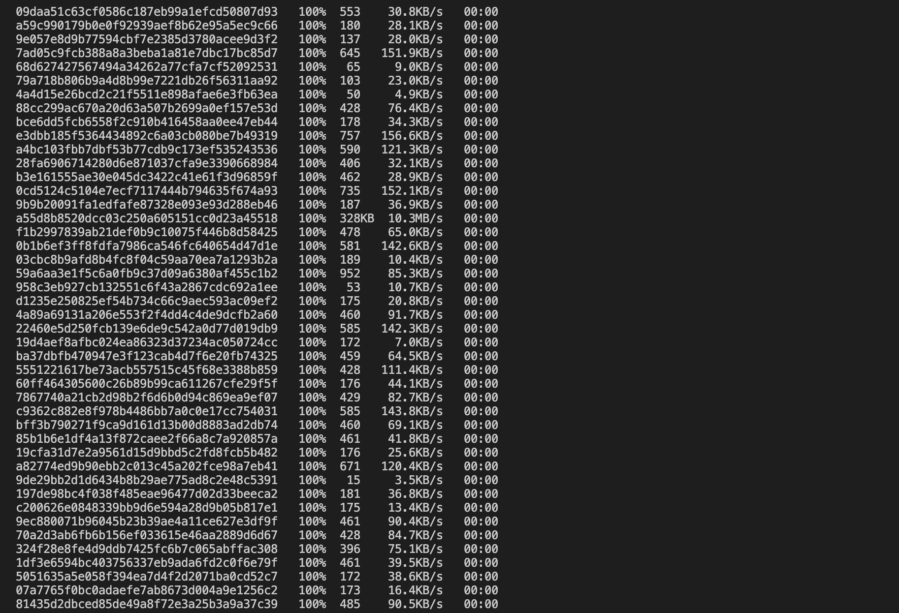
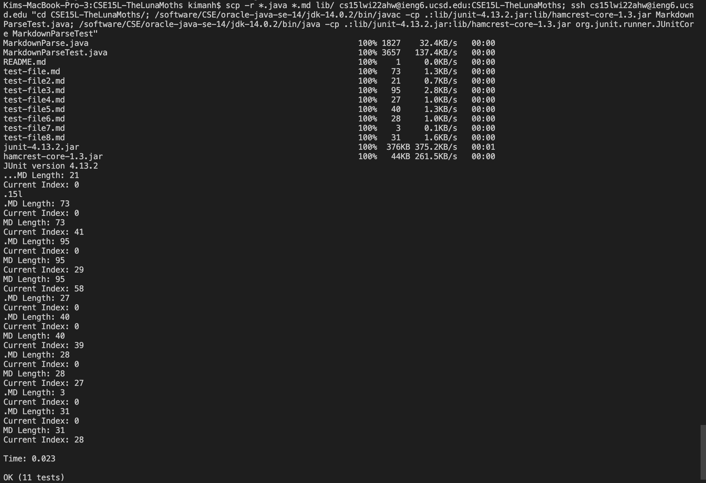

***
# Week 6 Lab Report
***
*Choosing choice 3 from Group Choice Options (1-3)*
## Group Choice 3 - Copy Whole Directories with `scp -r`
Use `scp` to copy *recursively*, copy a directory and all the files and directories within it, which means copy the whole **CSE15L-TheLunaMoths** directory to the **ieng6** server with one command. 

1. Checking the working directory (**CSE15L-TheLunaMoths**) before doing `scp` command:


2. Using `scp` to copy this directory to the remote server. The `-r` option makes `scp` to work *recursively*. The `.` is the *source* - which is current directory. The `~/CSE15L-TheLunaMoths` tells `scp` to create `CSE15L-TheLunaMoths` directory in the remote server, **ieng6** (if it doesn't exist), thus copy the contents of this directory recursively on the remove server.

    *Command:*
    ```
    $ scp -r . cs15lwi22ahw@ieng6.ucsd.edu:~/CSE15L-TheLunaMoths
    ```
    (When we do this it copies not just the files we see with ls, but all of the files in `.git` as well)

    *Screenshot of an example that using scp to copy the directory recursively*

    
    
    
    

3. To be more control with the files that we want to copy to the remote server, we can use this command:

    *Command:*
    ```
    $ scp -r *.java *.md lib/ cs15lwi22ahw@ieng6.ucsd.edu:CSE15L-TheLunaMoths
    ```
    `*.java` and `*.md` mean we only copy the files with the specific file types (in this case, only copy .java and .md file types)
    *Screenshot of an example that using the command to copy files:*
    

4. After copying the directory into the remote server, we can login to the ieng6's account and see all the files:

    *Command:*
    ```
    $ ssh cs15lwi22ahw@ieng6.ucsd.edu

    [cs15lwi22ahw@ieng6-203]:~:119$ ls CSE15L-TheLunaMoths
    ```

    *Screenshot of an example that logging in to the remote account to look for all files:*
    

    We can now run and compile the tests for the repository on the remote server:
    

5. Combining `scp`, `;`, and `ssh` to copy the whole directory and run the tests in one line:
    


