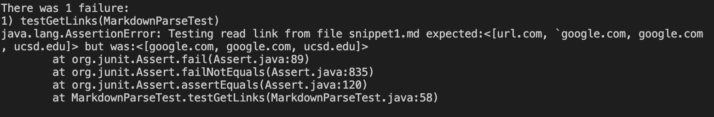

***
# Week 8 Lab Report
***

## **Respository Links**

[My markdown-parse repository](https://github.com/anhbch/CSE15L-TheLunaMoths)

[Reviewed markdown-parse repository](https://github.com/yaz067/markdown-parse)

## **Running and Debugging Markdown Snippets**

I used [CommonMark demo](https://spec.commonmark.org/dingus/) site for output produce. 
    
**My Group:**

* Code in `MarkdownParseTest.java`:
    

* Corresponding output when running the tests:
    

**Reviewed Group:**
* Code in `MarkdownParseTest.java`:
   

* Corresponding output when running the tests:
    
    
    

**Code Changes for Snippets**
* **Snippet1:**

    There is a small (<10 lines) code change that will make my program work for snippet 1 and all related cases that use inline code with backticks. Our group can a condition to locate the backticks and ignores **[** or **]** between them. 

* **Snippet2:**: 
   
   There is a large (>10 lines) code change that will make my program work for snippet 2 and all related cases that nest parentheses, brackets, and escaped brackets. Since our group code doesn't check for special characters inside **[ ]**. Therefore, we need to check for the special characters, recognize escaped brackets and parse the nested brackets. 

* **Snippet3:**

    There is a small (<10 lines) code change that will make your program work for snippet 3 and all related cases that have newlines in brackets and parentheses. Since our group only need to check for the spaces and lines inside the **()** and **[]** to determine if it's a valid link. 

