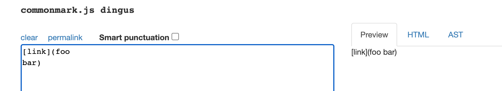
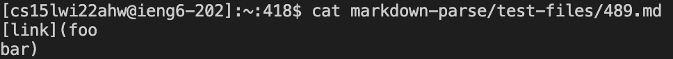

***
# Week 10 Lab Report
***

## **All Different Results**
***
* I used `diff` on the results of running a bash for loop.

*Screenshots of the different results:*

* Then I used command `cat markdown-parse/test-files/filename.md` to look at the test file to see why the results are diffrent between **markdown-parse-main** and **CSE15L-TheLunaMoths**.

## **Compare Two Tests**
***

## Expected outputs

* I used [CommonMark demo](https://spec.commonmark.org/dingus/) site for output produce.

 
 

## Test 1:
* Test file **494.md**:

 

 

* Our implementation shows `\(foo\` was a link is wrong since the expected output is `\(foo\)`. 

* The reason is because our code doesn't check which open and close parentheses are matched so it stops checking after the **)**. Instead of using indexOf, we can fix it by using a loop to keep track the **(** and **)**.

* The **markdown-parse** answer was correct because it matches the expected output. 

## Test 2:
* Test file **489.md**:

 

 

* Our implementation shows there was a link is wrong since the expected output shows that it's not a valid link. 

* The reason is because our code doesn't check for special characters or space and newline within the **()**. Therefore, it only checks for **[]** and **()**, and shows that it was a valid link even though the content contains a newline.  We can add code to check those issues in this loop below before deciding it's a valid link and adding it to *toReturn*. 

* The **markdown-parse** answer was correct because it matches the expected output. 